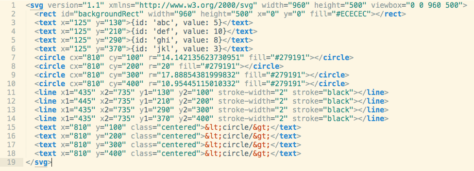
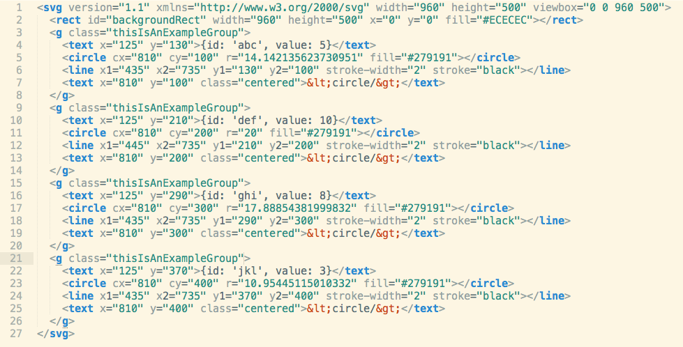

# power tools
## for powerful (data) visualization

### Jana Beck (@jebeck)
#### Software Engineer, Tidepool


## data visualization on the web


<small>Image source: "<a href="https://commons.wikimedia.org/wiki/File:SVG_logo.svg#/media/File:SVG_logo.svg">SVG logo</a>" by <a rel="nofollow" class="external text" href="http://www.w3.org/Graphics/SVG/">W3C</a>. Licensed under <a href="http://creativecommons.org/licenses/by/2.5" title="Creative Commons Attribution 2.5">CC BY 2.5</a> via <a href="//commons.wikimedia.org/wiki/">Wikimedia Commons</a></small>

Note:
Interactive data visualization with JavaScript is thriving, and it's a really exciting and collaborative sub-community within the broader webdev community.

Today I'll be focusing on the most widely-used toolset in interactive dataviz on the web - using the D3 JavaScript library to build visualizations in SVG.

All in all, this talk is one thing: everything I wish someone had told *me* before I embarked on the project of building a large and complex data visualization library.


## outline  

1. basics & best practices
1. profiling performance problems
1. solving performance problems
  1. general strategies
  1. dealing with large datasets

Note:
We'll start with some basic best practices when using D3 and SVG (and sneak in some intro to D3 stuff for those of you not already familiar with it).

Our next topic will be profiling performance problems in a data visualization. And hey, guess what? A lot of this stuff applies to any front-end JavaScript project with significant interactive elements.

After we've learned a bit about how to *find* performance problems in a data visualization, we'll move on to talking about a couple of additional tools for solving particular types of problems, particularly problems relating to the scale of real-world data sets.


## basics & best practices


## best practices with D3

- start with HTML and/or SVG
- `<canvas>` is the option of last resort

Note:
At its core, what D3 truly *is* is a JavaScript library for binding data to objects in the DOM. Most commonly, people use D3 to bind data to objects that are SVG elements like `<circle>` or `<rect>`, but binding to HTML elements is equally valid: D3 doesn't care.

I say `<canvas>` is the option of last resort because `<canvas>` is a *raster* image format (as opposed to a *vector* image format like SVG). There is only one element in the DOM when you create something with `<canvas>` - that's the `<canvas>` element itself. So you *lose* a lot of the power of D3 if you jump straight into `<canvas>`. It's possible, but it doesn't really make sense as the tool to start with.


### why D3 + HTML and/or SVG?

core function of D3 = bind data to DOM elements

<svg version="1.1" xmlns="http://www.w3.org/2000/svg" width="864" height="432" viewbox="0 0 720 240">
  <g transform="translate(0,128)">
    <g transform="translate(300)">
      <circle r="110" style="fill: rgb(49, 130, 189); fill-opacity: 0.2;"></circle>
      <text y="-120" dy=".35em" text-anchor="middle" style="font-size: 18px; font-weight: bold;">Data</text>
      <text x="-50" dy=".35em" text-anchor="middle" style="font-size: 18px;">Enter</text>
    </g>
    <text x="360" dy=".35em" text-anchor="middle"style="font-size: 18px;">Update</text>
    <g transform="translate(420)">
      <circle r="110" style="fill: rgb(230, 85, 13); fill-opacity: 0.2;"></circle>
      <text y="-120" dy=".35em" text-anchor="middle" style="font-size: 18px; font-weight: bold;">Elements</text>
      <text x="50" dy=".35em" text-anchor="middle" style="font-size: 18px;">Exit</text>
    </g>
  </g>
</svg>

<small>Image source: [Thinking with Joins](http://bost.ocks.org/mike/join/ 'Mike Bostock: Thinking with Joins')</small>

Note:
So: the core function of D3 is binding data to DOM elements. What does that mean? This Venn diagram illustrates D3's selections, which are your accessors into the binding between data and DOM elements.

The "enter" selection provides access to datum-element pairs where the DOM elements haven't actually been created yet. A little strange, I know. Basically, the thing to remember is that this is the selection you grab after you've bound your data and you want to create new elements.

The "update" selection provides access to the datum-element pairs where the element already exists in the DOM, but now it might need to change - in position or size, for example - because the datum the element is bound to has changed. Some projects won't need to use this selection, ever. Some data doesn't change. That's not unusual. But if you're visualizing data that updates in real time, the update selection is incredibly useful.

The "exit" selection is the opposite of the enter selection. It provides access to the datum-element pairs where the element already exists in the DOM but the data has just been unbound. When do you unbind data? One concrete example - and incidentally the type of visualization I've spent the most time developing - is when you're implementing a scrolling timeline visualization. So when the user scrolls away from the window of time initially rendered, you can reset the data you're binding to your DOM elements with only the data corresponding to what's *now* currently in view, then grab the exit selection to remove the elements from the DOM that were bound to the data that's no longer in view.


### a simple bar chart <small>(in code)</small>

```JavaScript
svg.selectAll('rect.bar')
  .data(data)
  .enter()
  .append('rect')
  .attr({
    x: function(d) { return xScale(d.framework); },
    y: function(d) { return yScale(d.value); },
    width: xScale.rangeBand(),
    height: function(d) { return margin.top + h - yScale(d.value); },
    fill: '#20479D',
    'class': 'bar'
  });
```

Note:
Here's a concrete example to illustrate. To create the bars for a very simple bar chart, we start by selecting all the SVG rects with the class "bar" within the SVG we've already set up. (This is the most counter-intuitive part, because this selection is currently *empty* because we haven't added any rects to the SVG yet.) We bind our array of data to this selection, then use `enter()` to grab the enter (sub-)selection. Once we have the enter selection, we can use a variety of the methods D3 provides (that is, `append` and `attr` methods here) to specify what action we want to be taken for each of the items in our current (sub-)selection.


### a simple bar chart <small>(in the browser)</small> 

<iframe width="960px" height="600px" seamless data-src="http://bl.ocks.org/jebeck/raw/90a75d5ba71c82df968e">

Note:
Here's what a such a very simple bar chart looks like in the browser.


### the world is flat



Note:
If we create everything exactly as shown just previously, we'll get a flat structure like this - everything on the same level inside the `<svg>` tag. Aside from being messy and hard to parse at a glance, this has some disadvantages in terms of limiting the ways you can build out the chart - for example, by adding some interactivity, as we'll see in a moment. And it also has some disadvantages in terms of performance.


### let's make it round



Note:
The alternative to a completely flat structure is using the SVG `<g>` element to - you guessed it - group related elements. If you want to relate this to HTML, the closest parallel to the `<g>` element is `<div>`. The `<g>` element doesn't have any default presentation attributes of its own, but it acts a container for other elements, and - crucially - can be used to efficiently effect changes on all of its children, as well as providing a way to better organize the elements in a visualization.


### `<g>` whiz, aren't groups nice?

<iframe width="960px" height="600px" seamless data-src="http://bl.ocks.org/jebeck/raw/cb801f32fc9777a1b672/">

Note:
Just the simple, possibly gimmicky addition of an overly literal "hover" animation on hover in this bar chart is made infinitely easier if all of the elements bound to the same datum - here that's the rect for the bar itself and the `<text>` for the number in the upper-left corner - are children of a single `<g>` element. Here I used a `transform` attribute on the group to change its position on hover, and so both the `<rect>` and the `<text>` move in tandem.


### groups and performance

```JavaScript
svg.selectAll('circle')
  .attr({
    transform: 'translate(0,-' + shiftAmount + ')'
  });
```

v.

```JavaScript
svg = svg.append('g');
...
svg.attr({
    transform: 'translate(0,-' + shiftAmount + ')'
  });
```

Note:
I mentioned previously that *not* using groups also has disadvantages in terms of performance. Here's what I mean by that. If we have a scatterplot with a large amount of data - all tiny circles - and we want to shift all the circles, there could be two ways of doing that. Select all the circles and move each one. Or select a group that contains all the circles and move the whole group by applying a `transform` attribute. It turns out the latter is *significantly* faster.


### let's prove it

<iframe width="960px" height="600px" seamless data-src="http://bl.ocks.org/jebeck/raw/816e9e5dc230252d4cc0/">

Note:
Looking at this example for experimentation purposees (we'll be coming back to this toy example later), we've got a scatterplot of 5,000 circles. If we want to shift them all, we can press the 'Shift' button, and a timer tells us it takes a negligible amount of time to do this. Well, spoiler: this is doing it the *smart* way, by applying a `transform` to a `<g>` element that contains all the circles. What if we don't do it the smart way? (Click the 'Slow?' checkbox next to the 'Shift' button, and you'll see.) Not doing it the smart way is greater than a 10x performance hit, and the more complex a visualization gets (with more and more layers of information and elements), the more that's going to hurt. So use groups, folks!


## profiling performance


### interactive data viz is `_____`

- snappy! <small>(not laggy)</small>
- crisp! <small>(not uncoordinated)</small>
- smooth! <small>(not stuttering)</small>

Note:
Just like any experience of a website or web application, we want the experience of an interactive data visualization to be snappy, crisp, and smooth, with no noticeable lag, desychronization, or stuttering from the point of view of the user.


### but sometimes it's...<small>(sadly)</small> *not*


Note:
Snappy, crisp, and smooth is not always what we get in an interactive data visualization, however, especially in the first iteration.


### 3 ways to profile performance

1. timers
1. frame rate meter
1. record a Timeline

Note:
In this section I'm going to introduce three of the tools I've found most useful for profiling the performance of a poorly-performing data visualization and finding the root cause of the slowness. These certainly aren't the only tools available for profiling performance, but they are what's - historically - worked best for me. They are (1) putting timers in your JavaScript, (2) turning on the frame rate meter in Chrome's developer tools to get a sense of the average frames per second and interactions that cause severe dips in frame rate, and (3) recording a Timeline (usually of one interaction, triggered by something like a click) in Chrome's developer tools to examine the performance of that interaction in detail.


### timers

instead of:
```JavaScript
var start = new Date();
...
console.log('Time elapsed is', new Date() - start);
```

try:
```JavaScript
console.time('Label');
...
console.timeEnd('Label');
```

Note:
Putting timers into your JavaScript is a pretty obvious beginner technique for profiling performance. There are a couple of disadvantages, of course. You can only add or move timers when you're live-coding, not profiling the performance of production code. And putting timers in your code to profile performance requires both having *some* idea of where your performance problems are and that those problems are easily isolated into blocks that can be wrapped with a timer in your raw JavaScript. Sometimes neither of these things is the case.
I see a lot of people using JavaScript's `Date` constructor to code timers in JavaScript, but this is in many cases unnecessary - most of the modern browsers implement the `console.time` and `console.timeEnd` methods. When you provide the same string identifier to a `time` and `timeEnd` method, you'll get a log statement in the console giving the time between the `time` and `timeEnd`. This can be especially useful if the structure of your code makes it difficult to define a time variable at the start of a timer and pick it up later - with the built-in console timer methods, you don't have to keep track of the start time yourself or do any subtraction to find the elapsed time.


### timers exposed

<iframe width="960px" height="600px" seamless data-src="http://bl.ocks.org/jebeck/raw/816e9e5dc230252d4cc0/">

Note:
Sometimes it's useful to wrap functions attached to certain interactions in your visualization within timers and actually expose the results in the UI as you're prototyping. Here we can see the difference between a slow data generation function and a fast one by paying attention to the logged data generation and data draw times in the UI when we do and don't have the slow checkbox selected for data generation and drawing.


### spying on framerate in Chrome


Note:
The next technique for profiling performance is to use Chrome's FPS meter.
Here's how you turn on the FPS meter in Chrome. Open the "drawer" in the Chrome dev tools by clicking the terminal prompt icon in the upper-right corner. Then click on the Rendering tab and select the 'Show FPS meter' checkbox. As long as you keep the devtools open, the FPS meter will be in the upper-right corner of the browser viewport.


Note:
Here's an example of what it looks like to watch the frame rate meter to profile a certain interaction - in this case the inversion of the y-scale for plotting the data when pressing the 'Invert' button in this toy example that renders a scatterplot of a thousand data points.
The two things to take most note of here are the FPS, which is a running average - we'll talk about that more in a second - and the range in the upper-right corner, which is thirty to sixty frames per second in this example. (In other words, none of the dips below 60fps that you can see in the timeline graph are falling below 30fps.)


Note:
Now here's another example of the same interaction but when *five* thousand data points are included in the scatterplot, which has a considerable negative impact on the performance. The average framerate is much lower here, and the lowest dips in the timeline graph fall far below 30fps - look at the range again the upper-right; it now says five to sixty frames per second.


### what's in the FPS meter display


Note:
This diagram comes straight from Chrome's documentation on the developer tools, and it points out the four things in the FPS meter display: the "current" frame rate (more on that in a second), the range from minimum to maximum frame rate, a histogram showing the frequency of certain frame rate values, and a timeline graph of the framerate on the page.


### a caveat re: Chrome's FPS meter

it's a running average

Note:
The most important caveat about using the framerate meter in Chrome is that the main reported metric is a *running* average; it's not really the current framerate, but rather the current of the running average. This means you have to be conscious of how you set up your "tests", and it also means that you can't pinpoint problems very precisely.


#### the FPS meter is good for...<small>(ballparking)</small>


<small>Image source: "<a href="https://commons.wikimedia.org/wiki/File:Marlins_First_Pitch_at_Marlins_Park,_April_4,_2012.jpg#/media/File:Marlins_First_Pitch_at_Marlins_Park,_April_4,_2012.jpg">Marlins First Pitch at Marlins Park, April 4, 2012</a>" by <a rel="nofollow" class="external text" href="http://www.flickr.com/people/77396461@N08">Roberto Coquis</a> - <a href="//commons.wikimedia.org/wiki/Flickr" title="Flickr" class="mw-redirect">Flickr</a>: <a rel="nofollow" class="external text" href="http://flickr.com/photos/77396461@N08/7087927325">Marlins First Pitch at Marlins Park, March 4, 2012</a>. Licensed under <a href="http://creativecommons.org/licenses/by/2.0" title="Creative Commons Attribution 2.0">CC BY 2.0</a> via <a href="//commons.wikimedia.org/wiki/">Wikimedia Commons</a>.</small>

Note:
All in all, what the framerate meter is best for is getting a ballpark measure of the performance of your visualization or of particular interactions within the visualization. It can help you get a general sense of how well the visualization is performing, and it can help you *start* to narrow down specific issues.


#### it's not good for...<small>(precise identification of problems)</small>


Note:
But it also isn't the right tool for finding the code responsible for poor performance or a dip in performance.


### jebeck's guide to <small>(running average)</small> FPS

Note:
With nothing but my own experience correlating what I've seen in Chrome's framerate meter to perceived performance on the part of those evaluating the software I've worked on, here's what I can tell you about using Chrome's running average framerate meter to get an idea of how well an interactive data visualization is performing.


#### good

- `50-60: :D`
- `40-50: :)`

Note:
If the framerate is pretty consistently between forty and sixty frames per second, this is good performance. Your users probably aren't noticing any lag or stuttering because any lag or stuttering is either rare or very subtle.


#### meh

- `30-40: ¯\_(ツ)_/¯`

Note:
If the framerate is consistently between thirty to forty frames per second, this is where a discerning user is probably starting to notice that things could be snappier or smoother, but the overall experience is still pretty good.


### **here be dragons**

- `20-30: :/`
- `00-20: D:`

Note:
Most users will notice if the framerate is consistently below thirty frames per second. They might describe the experience as sluggish or the interactions as jerky or laggy.


### data generation in example visualization

```JavaScript
function generateData(n) {
  for (var i = 0; i < n; ++i) {
    var dt = new Date(randomDate());
    data.push({
      id: i,
      value: randomValue(),
      timestamp: dt,
      dayOfWeek: moment(dt).format('dddd').toLowerCase()
    });
  }
}
```

Note:
Here's the function used to generate data for the example scatterplot visualization we've been playing with.


### example bottleneck

```JavaScript
function generateDataSlow(n) {
  for (var i = 0; i < n; ++i) {
    var dt = new Date(randomDate()).toISOString();
    data.push({
      id: i,
      value: randomValue(),
      timestamp: Date.parse(dt),
      dayOfWeek: moment(dt).format('dddd').toLowerCase()
    });
  }
}
```

Note:
And now here's an alternate version of the same data generation function that's actually a performance bottleneck we'll be able to find in a Timeline profile. This is, unfortunately, inspired by real mistakes I've made. One of the difficulties in dealing with a lot of time series data and having a complex codebase is that sometimes different parts of your code want to see datetimes in different ways, and you end up parsing and re-parsing datetimes between strings, objects, and integers. Because of the complexities involved, datetime parsing and processing is almost always pretty expensive, so these can easily add up into big bottlenecks in performance. This particular example is a little silly, but trust me these kinds of situations can arise spread across a more complex codebase. Here we're generating a native JavaScript `Date` but then immediately transforming it into an ISO-formatted string, then re-parsing it with `Date.parse` to get a Unix time integer and with `moment` to find the day of the week.


### recording a Timeline


Note:
To record a Timeline for a particular interaction in Chrome, first set up the UI into whatever state you need it to be in before the interaction you want to profile. Then open the developer tools and go to the Timeline tab. Make sure the Flame Chart View and Frames View buttons are on (highlighted in blue) and press record. Flip back to your app and do whatever interaction you're trying to profile - in this case by clicking the 'Generate and draw data' button. Stop the recording in the dev tools.
Pay attention to the color coding of the frames in the result - yellow is JavaScript. (The other colors are blue for loading, purple for rendering, and green for painting.) Zoom in on any tall yellow bars - these are JavaScript bottlenecks, or potential bottlenecks.


### finding bottlenecks in a Timeline

- width represents time
- look for things that don't make sense
- (divisions into separate horizontal blocks [often not significant](http://stackoverflow.com/questions/20627082/what-are-this-gap-mean-in-chrome-devtools-profile-flame-chart/20652758#20652758))

Note:
Finding bottlenecks by looking at a timeline is more of an art than a science, and you'll get better at it with practice. The most important thing to remember is that width represents time, so you're looking for particularly wide things (or a series of things) that don't make sense. Also important to note - and this is something it took me a while to track down in the Stack Overflow answer linked here - is that the splitting up of something you expect to be a single function call into adjacent horizonatal blocks is common and not significant in most cases. That is, it doesn't have to do with your code, but rather with how the Chrome profiler is doing the statistical sampling it does to draw the Timeline's flame chart.


#### Timeline for `generateData`


Note:
So here's the flame chart from the timeline for the regular generateData function. We see here that generating the data takes less time than drawing it. This makes sense since drawing involves adding elements to the DOM, and DOM manipulation in general is expensive.


#### Timeline for `generateDataSlow`


Note:
And now here's the flame chart from the timeline for the generateDataSlow version of the data generation function. We see here that generating the data is now taking about 3-4 times *longer* than drawing it. This does *not* make sense, so here you'd want to drill down and see what's in those function calls in the call stack(s) below generateDataSlow. If you did that here, you'd see that what's in those function calls is pretty much all calls within moment.js because of the dumb additional time processing we added in the generateDataSlow function.


## improving performance

### general strategies


1. choose browser-native
1. change the DOM as little as possible

Note:
If I was asked to distill everything I've learned about making performant interactive data visualizations into a couple of statements, these would be it. First, whenever you have a choice between implementing your own version of something in JavaScript or using a browser-native version, go browser-native. Second, try to change the DOM as little as possible.


### why browser-native?

- better performance *now*
- and better performance in the future

Example: horizontal-scrolling timeline.

Note:
I've spent a lot of time over the past couple years working on horizontally scrolling timeline visualizations of data. There are two basic strategies for implementing any kind of scrolling timeline data display: you can render a very wide SVG and use the browser's native scrolling capabilities for navigation, or you can render an SVG exactly the size of the portion of the timeline currently in view and attach listeners to mouse events and touch events to change what's rendered within the SVG as the user interacts with the display. At first, I thought the second strategy made more sense. Rendering a very large SVG, the vast majority of which is not in view, seemed odd to me.
However, I've since changed my tune, for the simple reason that the browser-native strategy allows you to leverage *all* of the under-the-hood optimization that the browser vendors have put into (and will continue to build into, in the future) something like image scrolling performance. In this particular example - and I suspect in other parallel examples - that optimization yields significant performance gains over the JavaScript strategy.


### JavaScript version


Note:
And here's my evidence for what I just said. With a toy example of a horizontal scrolling timeline implemented entirely in JavaScript, we see a running average framerate of around thirty frames per second - not terrible, but not great.


### browser-native version


Note:
But now, taking a minimally different example, where the only difference is the choice to effect the horizontal scrolling timeline display by way of a very large SVG and browser-native scrolling, we find that the running average framerate up around fifty frames per second.


### code for examples

- [JavaScript-only scrolling](http://bl.ocks.org/jebeck/1974647d476b67a0439d 'Tideline-style virtual scrolling')
- [browser-native scrolling](http://bl.ocks.org/jebeck/5ffdaad2094499997a21 'Zipline-style virtual rendering on scroll')

Note:
If you want to take a closer look at these examples later, they are available on my bl.ocks page through these links. (By the way, if any of you aren't familiar with bl.ocks.org, it's a free viewer built on top of GitHub's gist functionality. Mike Bostock, the primary author of D3, built and maintains it, and it's a very popular place to find D3 examples.)


### wise words

"The browser was not designed to be constantly creating and throwing out DOM nodes."
(Pete Hunt)

Note:
The other key lesson I've learned through building complex interactive data visualizations is to touch the DOM as little as possible. This isn't exactly news. For example, Facebook's React is an entire front-end UI framework built on the principle of minimizing changes to the DOM. But just because it's common knowledge doesn't mean it's always easy to remember or follow when you're working.


### how to avoid changing the DOM

- data aggregation or smoothing
- reusing DOM nodes

Note:
What I've found most useful is to keep the question of "How much am I changing the DOM?" at the front of my mind when I'm working. Whenever the answer is "a lot", then I start to think about what I could do to avoid changing it that much. Can I aggregate the data or smooth it so that I'm creating or modifying fewer nodes in the DOM? If I'm coding an interaction that involves simultaneously inserting many new nodes and removing stale ones in response to an interaction, is there a way I can *recycle* the nodes I'm due to remove instead of trashing them, thereby reducing the number of new nodes I have to add, either partially or entirely?

<!-- TODO: add a slide illustrating aggregation as a solution - that is, a heat map? -->


### node reuse example

@gmaclennan's fast long-scrolling image grid

<iframe width="960px" height="455px" seamless data-src="http://bl.ocks.org/gmaclennan/raw/11130600/">

Note:
Here's a great example from bl.ocks illustrating node reuse. As the user scrolls in this image grid, instead of creating new rows as they come into view and destroying the old rows, the strategy is to relocate the old rows into the position(s) where new rows are needed. The result is a fast-scrolling, very-large grid.


## improving performance

### dealing with large datasets


so you have "big data"...<small>maybe?</small>

- *how* big is **big**?
- how big is *too big*?

Note:
"Big data" is a common phrase to hear these days, so common sometimes it seems like the only data anyone talks about is "big." Is your data big? If it is, will you be able to visualize it effectively and interactively in the browser?
My take on this question is that it doesn't matter if your data is "big" in the "big data" sense. The question should really be whether it's big for the browser or in particular whether it's big for the kind of interactions you want to build on top of it in the browser. So the question should be: is my data big for the browser?


in the browser, even small can be *too big*


Note:
And, unfortunately, the browser's idea of "big" can really be quite small.


### let's explore

<iframe width="960px" height="600px" seamless data-src="http://bl.ocks.org/jebeck/raw/816e9e5dc230252d4cc0/">

Note:
Plotting 5,000 nodes in a scatterplot is at the edge of acceptability, depending on what kind of interactions we might need. 10,000 is definitely way too much. If you can't aggregate or smooth your way out of that one and you need interactivity, `<canvas>` may be the way to go.


### tools to help


Note:
There are a couple of great open-source JavaScript libraries that provide utilties specifically for performing very fast filtering on very large datasets - hundreds of thousands of items - in the browser. If you have a performance bottleneck due to filtering the data needed to effect an interaction, using one of these libraries may help immensely.


### crossfilter

- first choice for a filtering helper
- provides a wider variety of functionality:
    + numerical querying
    + map-reduce on (sub-)groups

Note:
Crossfilter was authored by some of the same developers who created D3 (including Mike Bostock). I think it should probably be your first choice for a filtering helper because it provides a real wealth of functionality, including all sorts of numerical querying - for exact values, values in a range, and there's even a way to implement union filters (less than 5 and greater than 10, for example) quite easily. You can also divide the data into groups and reduce them in a variety of ways, including custom reductions.


### PourOver

- client-side faceted search
- works well for *categorical* data

Note:
The original use case for PourOver is essentially client-side faceted search. If your data or your interactions on top of your data fit this use case - think tag filters in many combinations - then PourOver would definitely be worth checking out.


## thank you!