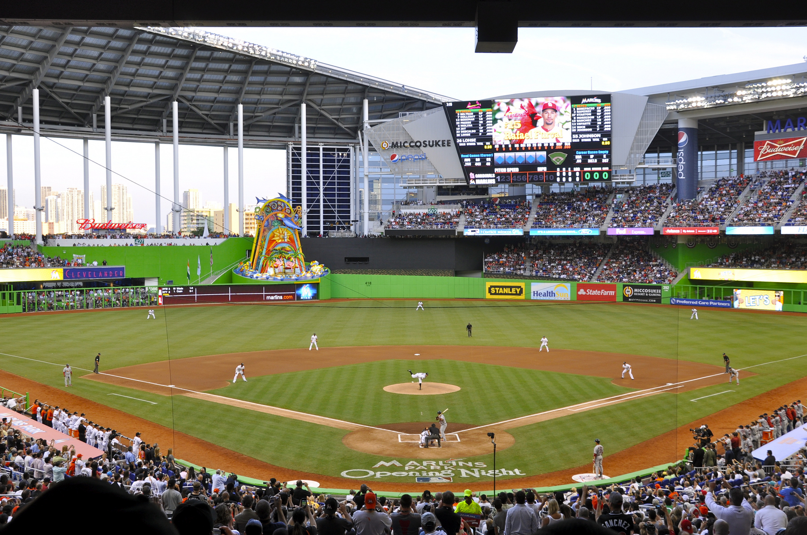

# power tools
## for powerful (data) visualization

### Jana Beck (@jebeck)
#### Software Engineer, Tidepool


## data visualization on the web

Note:
Interactive data visualization with JavaScript is thriving, and it's a really exciting and collaborative sub-community within the broader webdev community, but that's not to say that working in this space is rainbows and sparkles, all the time. There are a lot of challenges in coding a highly interactive interface on top of a large, real-world dataset. In fact, I think it's fair to say that what's in this talk is everything I wish someone had told *me* before I embarked on the project of building a large and complex data visualization library. I'm going to share with you the toolset I've gathered for myself as a result of the work I've been doing for the last couple of years; I hope you'll find it useful!


<small>Image source: "<a href="https://commons.wikimedia.org/wiki/File:SVG_logo.svg#/media/File:SVG_logo.svg">SVG logo</a>" by <a rel="nofollow" class="external text" href="http://www.w3.org/Graphics/SVG/">W3C</a>. Licensed under <a href="http://creativecommons.org/licenses/by/2.5" title="Creative Commons Attribution 2.5">CC BY 2.5</a> via <a href="//commons.wikimedia.org/wiki/">Wikimedia Commons</a></small>

Note:
What I'll be focusing on today is the most widely-used toolset in interactive dataviz on the web: this is D3, used to build visualizations in SVG. If you're not familiar with SVG, it's an XML-based vector image format: what this means is that all the components of an SVG image are XML elements that sit in the DOM very much like HTML elements - most SVG properties can even be styled via CSS stylesheets.


## outline  

1. basics & best practices
1. profiling performance problems
1. solving performance problems
  1. general strategies
  1. dealing with large datasets

Note:
Let's pause for a second though - I want to give you a preview of what's to come.

First, we'll start by talking about what I think is one of the most important best practices when using D3 with SVG - using SVG groups.

That discussion will lead us directly into a discussion around profiling performance problems in a data visualization. I'll spend the most time on this because it's the thing I most wish someone had showed *me* and also because it has the broadest applicability to other front-end applications. What we'll discuss in terms of profiling should apply to any front-end JavaScript project that has a lot of interactive elements.

After we've learned a bit about how to *find* performance problems in a data visualization, we'll wrap up by going over a couple of additional strategies and tools for solving particular types of problems.


## basics & best practices


## why D3 + SVG?

<svg version="1.1" xmlns="http://www.w3.org/2000/svg" width="864" height="450" viewbox="0 0 960 500">
  <rect id="backgroundRect" width="960" height="500" x="0" y="0" fill="#ECECEC"></rect>
  <g class="thisIsAnExampleGroup">
    <text x="125" y="130">{id: 'abc', value: 5}</text>
    <circle cx="810" cy="100" r="14.142135623730951" fill="#279191"></circle>
    <line x1="435" x2="735" y1="130" y2="100" stroke-width="1" stroke="black"></line>
    <text x="810" y="100" class="centered">&lt;circle/&gt;</text>
  </g>
  <g class="thisIsAnExampleGroup">
    <text x="125" y="210">{id: 'def', value: 10}</text>
    <circle cx="810" cy="200" r="20" fill="#279191"></circle>
    <line x1="445" x2="735" y1="210" y2="200" stroke-width="1" stroke="black"></line>
    <text x="810" y="200" class="centered">&lt;circle/&gt;</text>
  </g>
  <g class="thisIsAnExampleGroup">
    <text x="125" y="290">{id: 'ghi', value: 8}</text>
    <circle cx="810" cy="300" r="17.88854381999832" fill="#279191"></circle>
    <line x1="435" x2="735" y1="290" y2="300" stroke-width="1" stroke="black"></line>
    <text x="810" y="300" class="centered">&lt;circle/&gt;</text>
  </g>
  <g class="thisIsAnExampleGroup">
    <text x="125" y="370">{id: 'jkl', value: 3}</text>
    <circle cx="810" cy="400" r="10.95445115010332" fill="#279191"></circle>
    <line x1="435" x2="735" y1="370" y2="400" stroke-width="1" stroke="black"></line>
    <text x="810" y="400" class="centered">&lt;circle/&gt;</text>
  </g>
</svg>

Note:
At its core, what D3 truly *is* is a JavaScript library for binding data to elements in the DOM. Most commonly, people use D3 to bind data to objects that are SVG elements like `<circle>` or `<rect>`, but binding to HTML elements is equally valid: D3 doesn't care.

That said, `<canvas>` should be your option of last resort because `<canvas>` is a *raster* image format (as opposed to a *vector* image format like SVG). There is only one element in the DOM when you create something with `<canvas>` - that's the `<canvas>` element itself. So you *lose* a lot of the power of D3 if you jump straight into `<canvas>` because you can't bind your data to the element or elements plural in the DOM that are representing each datum.

Once you've learned all about the interface D3 provides to bind data to elements in the DOM and manipulate them - this is through three "selections" in the D3 parlance: the enter, update, and exit selections - there really isn't all that much in terms of major concepts to learn. D3 provides a lot of other useful functionality for manipulating and representing data according to some very common data visualization design patterns, but in a lot of ways D3 is a pretty concise, elegant project. The real difficulty, in my experience, in becoming proficient at data visualization with D3 and SVG is the SVG half of that equation.

If you want to be successful at data visualization, what you need beyond an understanding of D3 is a deep knowledge of SVG, which brings me to the first of the power tools I'm going to introduce you to today: SVG group elements.


### `<g>` whiz, aren't groups nice?

- organization
- interaction
- performance

Note:
There are three reasons to use the SVG group element: organization, interaction, and performance.

(IF NEED MORE: Add an explanation about parallel to HTML `<div>`.)


### *no* groups and *dis*organization


Note:
Without groups - with a flat internal structure instead - an SVG gets messy and hard to inspect and debug in your favorite browser's developer tools.


### groups and organization


Note:
With groups it's much easier to see how elements of different types are being used together to represent each datum.


### groups and interaction

<svg version="1.1" xmlns="http://www.w3.org/2000/svg" width="864" height="450" viewbox="0 0 960 500">
  <rect id="backgroundRect" width="960" height="500" x="0" y="0" fill="#ECECEC"></rect>
  <g class="thisIsAnExampleGroup">
    <text x="125" y="130">{id: 'abc', value: 5}</text>
    <circle cx="810" cy="100" r="14.142135623730951" fill="#279191"></circle>
    <line x1="435" x2="735" y1="130" y2="100" stroke-width="1" stroke="black"></line>
    <text x="810" y="100" class="centered">&lt;circle/&gt;</text>
  </g>
  <g class="thisIsAnExampleGroup">
    <text x="125" y="210">{id: 'def', value: 10}</text>
    <circle cx="810" cy="200" r="20" fill="#279191"></circle>
    <line x1="445" x2="735" y1="210" y2="200" stroke-width="1" stroke="black"></line>
    <text x="810" y="200" class="centered">&lt;circle/&gt;</text>
  </g>
  <g class="thisIsAnExampleGroup">
    <text x="125" y="290">{id: 'ghi', value: 8}</text>
    <circle cx="810" cy="300" r="17.88854381999832" fill="#279191"></circle>
    <line x1="435" x2="735" y1="290" y2="300" stroke-width="1" stroke="black"></line>
    <text x="810" y="300" class="centered">&lt;circle/&gt;</text>
  </g>
  <g class="thisIsAnExampleGroup">
    <text x="125" y="370">{id: 'jkl', value: 3}</text>
    <circle cx="810" cy="400" r="10.95445115010332" fill="#279191"></circle>
    <line x1="435" x2="735" y1="370" y2="400" stroke-width="1" stroke="black"></line>
    <text x="810" y="400" class="centered">&lt;circle/&gt;</text>
  </g>
</svg>

<!-- TODO: add the interaction here via CSS animations or put the GIF back -->

Note:
And groups also give us easily accessible hooks for layering on interactions concisely and logically.


### groups and performance


Note:
Finally, using groups is actually more efficient and performant than not using them.

Looking at this example for experimentation purposees (we'll be seeing more of this toy example later), we've got a scatterplot of 5,000 circles. If we want to shift them all, we can press the 'Shift' button, and a timer tells us it takes a negligible amount of time to do this. Well, spoiler: this is doing it the *smart* way, by applying a `transform` to a `<g>` element that contains all the circles. What if we don't do it the smart way? What if we select all the circles and apply a `transform` to each? (Click the 'Slow?' checkbox next to the 'Shift' button, and you'll see.) Not doing it the smart way is greater than a 10x performance hit, and the more complex a visualization gets (with more and more layers of information and elements), the more that's going to hurt.


## profiling performance


### interactive data viz is `_____`

- snappy! <small>(not laggy)</small>
- crisp! <small>(not uncoordinated)</small>
- smooth! <small>(not stuttering)</small>

Note:
Just like any experience of a website or web application, we want the experience of an interactive data visualization to be snappy, crisp, and smooth, with no noticeable lag, desychronization, or stuttering from the point of view of the user.


### but sometimes it's...<small>(sadly)</small> *not*


Note:
Snappy, crisp, and smooth is not always what we get, however, especially in the first iteration. What I'm going to talk about now is the tools I've found most useful for profiling the performance of a data visualization and moving forward from the disappointing first pancake.


### 3 ways to profile performance

1. timers
1. framerate meter
1. record a Timeline

Note:
The three profiling tools I use most are putting timers in your JavaScript, the framerate meter in Chrome's developer tools, and the Timeline tool in Chrome's developer tools.

Some of these tools work well with each other, and know which tool to use when and for what is important. So let's dive in!


### timers

instead of:
```JavaScript
var start = new Date();
...
console.log('Time elapsed is', new Date() - start);
```

try:
```JavaScript
console.time('Label');
...
console.timeEnd('Label');
```

Note:
Putting timers into your JavaScript is a pretty obvious beginner technique for profiling performance. I regularly wrap a timer around the main render method in all my data visualizations, because rendering - that is, manipulating the DOM to reflect the data being visualized - is often, if not always, the most expensive part of the code for a visualization, performance-wise.

The problem with timers is that if you put them in the wrong place, you won't learn anything. If you have *no idea* what or where the cause of a performance problem is, timers aren't going to help you.

So let's move on to the other two tools, which can help you *find* performance problems.


### spying on framerate in Chrome


Note:
Chrome's framerate meter was honestly a huge revelation for me, after I learned about it and started using it. This GIF is showing you how to turn it on - I won't walk you through the steps, these slides are online for reference. What's important to remember is that you have to leave the developer tools open in order to have the framerate meter in the upper right of the browser viewport. You can minimize the dev tools (and I often do, after popping them out into a separate window), but they have to be open.


Note:
Here's an example of what it looks like to watch the framerate meter to profile a certain interaction - in this case the inversion of the y-scale for plotting the data when pressing the 'Invert' button in this toy example that renders a scatterplot of a thousand data points.

The two things to take most note of here are the FPS, which is a running average - we'll talk about that more in a second - and the range in the upper-right corner, which is thirty to sixty frames per second in this example. (In other words, none of the dips below 60fps that you can see in the timeline graph are falling below 30fps.)


Note:
Now here's another example of the same interaction but when *five* thousand data points are included in the scatterplot, which has a considerable negative impact on the performance. (Performance in data visualization is often a simple numbers game - the more things you're trying to do in or manipulate in the DOM, the worse the performance is going to be.)


### what's in the FPS meter display


Note:
This diagram comes straight from Chrome's documentation on the developer tools, and it points out the four things in the FPS meter display: the "current" framerate (more on that in a second), the range from minimum to maximum framerate, a histogram showing the frequency of certain framerate values, and a timeline graph of the framerate on the page.


### a caveat re: Chrome's FPS meter

it's a running average

Note:
The most important caveat about using the framerate meter in Chrome is that the main reported metric is a *running* average; it's not really the current framerate, but rather the current of the running or moving average. This means you have to be conscious of how you set up your "tests", and it also means that you can't pinpoint problems very precisely.


#### the FPS meter is good for...<small>(ballparking)</small>



<small>Image source: "<a href="https://commons.wikimedia.org/wiki/File:Marlins_First_Pitch_at_Marlins_Park,_April_4,_2012.jpg#/media/File:Marlins_First_Pitch_at_Marlins_Park,_April_4,_2012.jpg">Marlins First Pitch at Marlins Park, April 4, 2012</a>" by <a rel="nofollow" class="external text" href="http://www.flickr.com/people/77396461@N08">Roberto Coquis</a> - <a href="//commons.wikimedia.org/wiki/Flickr" title="Flickr" class="mw-redirect">Flickr</a>: <a rel="nofollow" class="external text" href="http://flickr.com/photos/77396461@N08/7087927325">Marlins First Pitch at Marlins Park, March 4, 2012</a>. Licensed under <a href="http://creativecommons.org/licenses/by/2.0" title="Creative Commons Attribution 2.0">CC BY 2.0</a> via <a href="//commons.wikimedia.org/wiki/">Wikimedia Commons</a>.</small>

Note:
All in all, what the framerate meter is best for is getting a ballpark measure of the performance of your visualization or of particular interactions within the visualization. It can help you get a general sense of how well the visualization is performing, and it can help you *start* to narrow down specific issues.


#### it's not good for...<small>(precise identification of problems)</small>


Note:
But it also isn't the right tool for finding the code responsible for poor performance or a dip in performance.


### jebeck's guide to <small>(running average)</small> FPS

Note:
With nothing but my own experience correlating what I've seen in Chrome's framerate meter to perceived performance on the part of those evaluating the software I've worked on, here's what I can tell you about using Chrome's running average framerate meter to get an idea of how well an interactive data visualization is performing.


#### good

- `50-60: :D`
- `40-50: :)`

Note:
If the framerate is pretty consistently between forty and sixty frames per second, this is good performance. Your users probably aren't noticing any lag or stuttering because any lag or stuttering is either rare or very subtle.


#### meh

- `30-40: ¯\_(ツ)_/¯`

Note:
If the framerate is consistently between thirty to forty frames per second, this is where a discerning user is probably starting to notice that things could be snappier or smoother, but the overall experience is still pretty good.


### **here be dragons**

- `20-30: :/`
- `00-20: D:`

Note:
Most users will notice if the framerate is consistently below thirty frames per second. They might describe the experience as sluggish or the interactions as jerky or laggy.


### finding problems with the Timeline view

Note:
So far we've talked about two tools that *aren't* good for finding performance bottlenecks. So what do you use when you *do* need to pin down a problem? I used the Timeline tool in the Chrome dev tools. Using the toy example scatterplot we've seen a couple times now, I'm going to show you how to find a bottleneck I intentionally put in there as an example.


### data generation in example visualization

```JavaScript
function generateData(n) {
  for (var i = 0; i < n; ++i) {
    var dt = new Date(randomDate());
    data.push({
      id: i,
      value: randomValue(),
      timestamp: dt,
      dayOfWeek: moment(dt).format('dddd').toLowerCase()
    });
  }
}
```

Note:
Here's the function used to generate data for the example scatterplot visualization we've been playing with.


### example bottleneck

```JavaScript
function generateDataSlow(n) {
  for (var i = 0; i < n; ++i) {
    var dt = new Date(randomDate()).toISOString();
    data.push({
      id: i,
      value: randomValue(),
      timestamp: Date.parse(dt),
      dayOfWeek: moment(dt).format('dddd').toLowerCase()
    });
  }
}
```

Note:
And now here's an alternate version of the same data generation function that's going to be our white whale. This is, unfortunately, inspired by real mistakes I've made. One of the difficulties in dealing with a lot of time series data and having a complex codebase is that sometimes different parts of your code want to see datetimes in different ways, and you end up parsing and re-parsing datetimes between strings, objects, and epoch integers. Because of the complexities involved, datetime parsing and processing is almost always pretty expensive, so these can easily add up into big bottlenecks in performance. This particular example is a little silly, but trust me these kinds of situations can arise spread across a more complex codebase. Here we're generating a native JavaScript `Date` but then immediately transforming it into an ISO-formatted string, then re-parsing it with `Date.parse` to get a Unix time integer and with `moment` to find the day of the week.


### recording a Timeline


Note:
Here's a GIF of my workflow setting up and recording a timeline of a particular interaction - in this case the 'Generate & Draw' interaction in the toy example scatterplot. Again, I'm not going to walk you through it step by step, but I'll point out that you'll want to pay particular attention to the color coding of the frames in the result. (Each vertical bar is a frame.) The color coding is blue for loading, purple for rendering, green for painting, and yellow for scripting. You'll want to zoom in on any tall yellow bars - these are the likely JavaScript bottlenecks.


### finding bottlenecks in a Timeline

- width represents time
- look for things that don't make sense
- (divisions into separate horizontal blocks [often not significant](http://stackoverflow.com/questions/20627082/what-are-this-gap-mean-in-chrome-devtools-profile-flame-chart/20652758#20652758))

Note:
Finding bottlenecks by looking at a timeline is more of an art than a science, and you'll get better at it with practice. The most important thing to remember is that width represents time, so you're looking for particularly wide things (or a series of things) that don't make sense. Also important to note - and this is something it took me a while to track down in the Stack Overflow answer linked here - is that the splitting up of something you expect to be a single function call into adjacent horizonatal blocks is common and not significant in most cases. That is, it doesn't have to do with your code, but rather with how the Chrome profiler is doing the statistical sampling it does to draw the Timeline's flame chart.


#### Timeline for `generateData`


Note:
So here's the flame chart from the timeline for the regular `generateData` function. We see here that generating the data takes less time than drawing it. This makes sense since drawing involves adding elements to the DOM, and DOM manipulation in general is expensive.


#### Timeline for `generateDataSlow`


Note:
And now here's the flame chart from the timeline for the `generateDataSlow` version of the data generation function. We see here that generating the data is now taking about 3-4 times *longer* than drawing it. This does *not* make sense, so here you'd want to drill down and see what's in those function calls in the call stack(s) below `generateDataSlow`. If you did that here, you'd see that what's in those function calls is pretty much all calls within moment.js because of the dumb additional time processing we added in the `generateDataSlow` function.


## improving performance

Note:
Now that we've covered the most useful tools for profiling performance issues in a complex data visualization, let's briefly talk about some of the general strategies and tools for coding high-performance data visualizations.


### general strategies

1. choose browser-native
1. change the DOM as little as possible

Note:
If I was asked to distill everything I've learned about making performant interactive data visualizations into a couple of statements, these would be it. First, whenever you have a choice between implementing your own version of something in JavaScript or using a browser-native version, go browser-native. Second, try to change the DOM as little as possible.


### why browser-native?

- better performance *now*
- and better performance in the future

Example: horizontal-scrolling timeline.

Note:
I've spent a lot of time over the past couple years working on horizontally scrolling timeline visualizations of data. There are two basic strategies for implementing any kind of scrolling timeline data display: you can render a very wide SVG and use the browser's native scrolling capabilities for navigation, or you can render an SVG exactly the size of the portion of the timeline currently in view and attach listeners to mouse events and touch events to change what's rendered within the SVG as the user interacts with the display. At first, I thought the second strategy made more sense. Rendering a very large SVG, the vast majority of which is not in view, seemed odd to me.

However, I've since changed my tune, for the simple reason that the browser-native strategy allows you to leverage *all* of the under-the-hood optimization that the browser vendors have put into (and will continue to build into, in the future) something like image scrolling performance. In this particular example - and I suspect in other parallel examples - that optimization yields significant performance gains over the JavaScript strategy.


### JavaScript version


Note:
And here's my evidence for what I just said. With a toy example of a horizontal scrolling timeline implemented entirely in JavaScript, we see a running average framerate of around thirty frames per second - not terrible, but not great.


### browser-native version


Note:
But now, taking a minimally different example, where the only difference is the choice to effect the horizontal scrolling timeline display by way of a very large SVG and browser-native scrolling, we find that the running average framerate up around fifty frames per second.


### code for examples

- [JavaScript-only scrolling](http://bl.ocks.org/jebeck/1974647d476b67a0439d 'Tideline-style virtual scrolling')
- [browser-native scrolling](http://bl.ocks.org/jebeck/5ffdaad2094499997a21 'Zipline-style virtual rendering on scroll')

Note:
If you want to take a closer look at these examples later, they are available on my bl.ocks page through these links. (By the way, if any of you aren't familiar with bl.ocks.org, it's a free viewer built on top of GitHub's gist functionality. Mike Bostock, the primary author of D3, built and maintains it, and it's a very popular place to find D3 examples.)


### wise words

"The browser was not designed to be constantly creating and throwing out DOM nodes."
(Pete Hunt)

Note:
The other key lesson I've learned through building complex interactive data visualizations is to touch the DOM as little as possible. This isn't exactly news. For example, Facebook's React is an entire front-end UI framework built on the principle of minimizing changes to the DOM. But just because it's common knowledge doesn't mean it's always easy to remember or follow when you're working.


### how to avoid changing the DOM

- data aggregation or smoothing
- reusing DOM nodes

Note:
What I've found most useful is to keep the question of "How much am I changing the DOM?" at the front of my mind when I'm working. Whenever the answer is "a lot", then I start to think about what I could do to avoid changing it that much. Can I aggregate the data or smooth it so that I'm creating or modifying fewer nodes in the DOM? If I'm coding an interaction that involves simultaneously inserting many new nodes and removing stale ones in response to an interaction, is there a way I can *recycle* the nodes I'm due to remove instead of trashing them, thereby reducing the number of new nodes I have to add, either partially or entirely? 

<!-- TODO: add a slide illustrating aggregation as a solution - that is, a heat map? -->


### node reuse example

[@gmaclennan's fast long-scrolling image grid](http://bl.ocks.org/gmaclennan/11130600 'bl.ocks: Fast long-scrolling image grid')

<iframe width="960px" height="455px" seamless data-src="http://bl.ocks.org/gmaclennan/raw/11130600/">

Note:
Here's a great example from bl.ocks illustrating node reuse. As the user scrolls in this image grid, instead of creating new rows as they come into view and destroying the old rows, the strategy is to relocate the old rows into the position(s) where new rows are needed. The result is a fast-scrolling, very-large grid.


### dealing with large datasets


Note:
There are a couple of great open-source JavaScript libraries that provide utilties specifically for performing very fast filtering on very large datasets - hundreds of thousands of items - in the browser. If you have a performance bottleneck due to filtering the data needed to effect an interaction, using one of these libraries may help immensely.


### crossfilter

- first choice for a filtering helper
- provides a wider variety of functionality:
    + numerical querying
    + map-reduce on (sub-)groups

Note:
Crossfilter was authored by some of the same developers who created D3 (including Mike Bostock). I think it should probably be your first choice for a filtering helper because it provides a real wealth of functionality, including all sorts of numerical querying - for exact values, values in a range, and there's even a way to implement union filters (less than 5 and greater than 10, for example) quite easily. You can also divide the data into groups and reduce them in a variety of ways, including custom reductions.


### PourOver

- client-side faceted search
- works well for *categorical* data

Note:
The original use case for PourOver is essentially client-side faceted search. If your data or your interactions on top of your data fit this use case - think tag filters in many combinations - then PourOver would definitely be worth checking out.


## in conclusion


### learn SVG


### profile as you work

  + timers
  + FPS meter
  + Timeline


### strategize

  + let the browser do the work
  + touch the DOM as little as possible
  + use helpers for big data


### thank you!